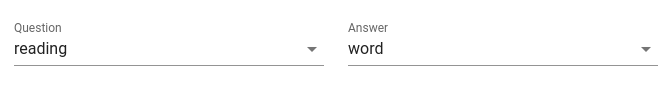
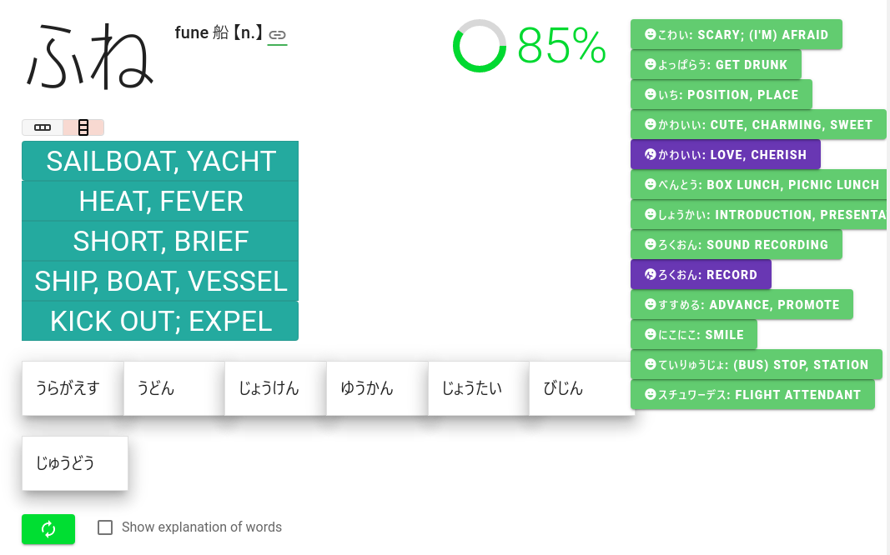

# word-decks

**_Deck = pack of cards_**

This is a simple application for language learning, displaying
a deck of cards with words and their meaning and pronunciation.

The player is asked to choose among the multiple choice the correct
pronunciation of the word in highlight. The score is kept.

All configuration items, custom word-sets and the score are kept inside the browser the player uses. Thus if the player switches to another browser, those information cannot be shared.

The player is not identified or authenticated, there is no remote storage to keep any personal information of the player.

## Functionalities
It is suited for learning languages like Japanese, as the multiple-choice proposes the pronunciations of different words.

### Playing, and hopefully learning
The multiple choices are selected from the current choice of word set. Within the word set, other choices which _resemble_ the most to the expected answer are displayed as clickable candidates.

When the player clicks on the right choice, then the application shows the next word with its multiple-choice candidates. If the choice is bad, until the player chooses the right one, the application keeps showing the same word and its choices.

In order to keep the player's concentration, there is no exciting feed-back for the right or wrong answers.

### Adding/removing word-sets.
A set of words can be added to the application.

The file containing the word set should be either in
- JSON or
- CSV

format, and should at least have `word`, `reading`, `definition` and `part` fields.

The user should drag and drop the CSV/JSON file onto the applicaton.

**Caveats**:
The application has a limitation of not being able to play well with word sets with **small number of entries**.

And it supposes that the entries in the word set are sorted in the order of **difficulty** (from the easiest to the most difficult). In our default `"(internal)"` word set, the order was the usage frequency from the most used to the least used.

### Internationalization
By default, French is selected.

**Caveat**:
There are only English, French and Japanese languages are available for now.

### Miscellaneous
[Vue 2](https://github.com/vuejs/vue#readme), [Vuetify](https://vuetifyjs.com/), [CSV](https://csv.js.org/)

[Levenshtein Distance](https://www.tutorialspoint.com/levenshtein-distance-in-javascript) technique has been used to compute the resemblance between words.

Big love and thanks to **[Jisho.org](https://jisho.org/)**! The application displays links to this wonderful site.

# Now possible to configure the fields for Question and Answer

By default the Question is the shown **word** (kanji) and the Answer is chosen by user among the multiple choice of **reading** (kana).

Default setting:
 Question | Answer
----------|-------
 word | reading

Now the combination can be freely set by user.

Below is a capture under setting of "show `reading` to choose `definition`":
